# 🤝 Mthandizi

Mthandizi is a software solution designed to translate **hand gestures into text or speech**, and conversely, **convert text or speech into hand gestures**. This project aims to bridge communication barriers for **deaf students in Malawi**, enhancing accessibility in educational settings. Additionally, it aspires to expand into **broadcasting stations**, providing real-time sign language translation of news for the deaf community.

---

## 📌 Scope

The system consists of the following components:

1. Training the system with different gestures  
2. Reading a gesture  
3. Making a sentence from hand gestures  
4. Translating speech/text to Sign language  
5. Speech to text  
6. Printing of documents  

A simple user interface is provided for users to easily select the necessary options.

---

## 🎯 Goals

1. Increase inclusion of deaf people in various associations  
2. Provide better learning methods for deaf students  
3. Eliminate communication barriers for deaf individuals in meetings  
4. Offer an innovative platform applicable to multiple sectors

---

## 👥 Use Case

Here are two typical use cases of Mthandizi:

  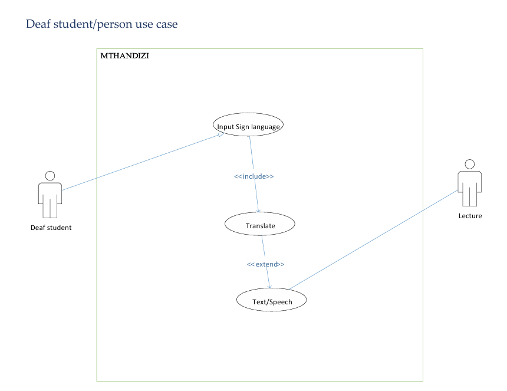
  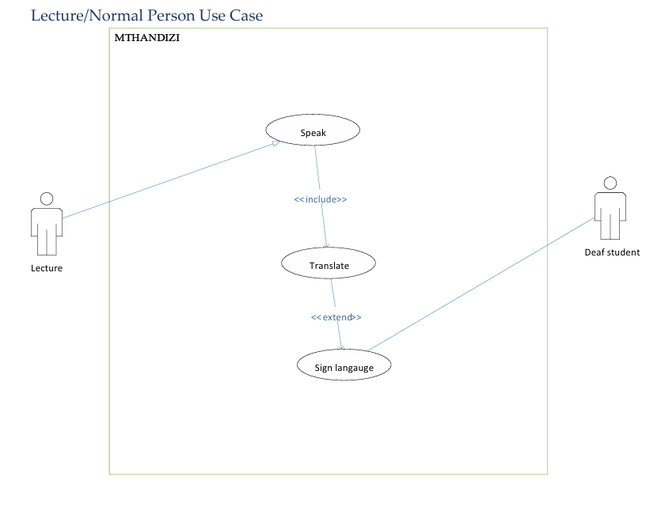
  

---

## 🧭 User Menu

1. Speech to Text  
2. Speech to Sign  
3. Sign to Text/Speech  
4. Training Gestures  
5. Printing translated speech to PDF  
6. Help

  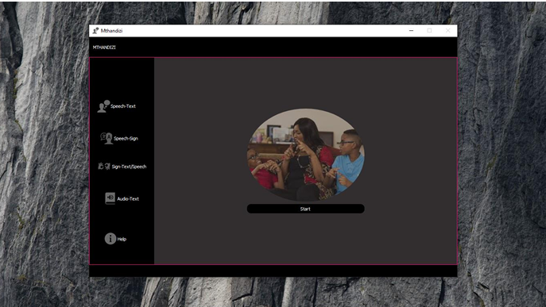
  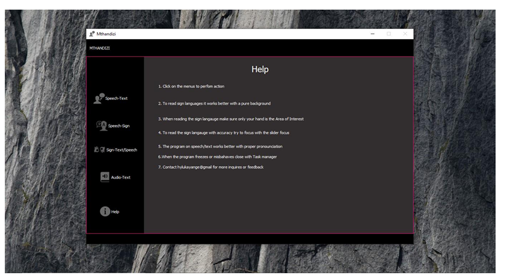
  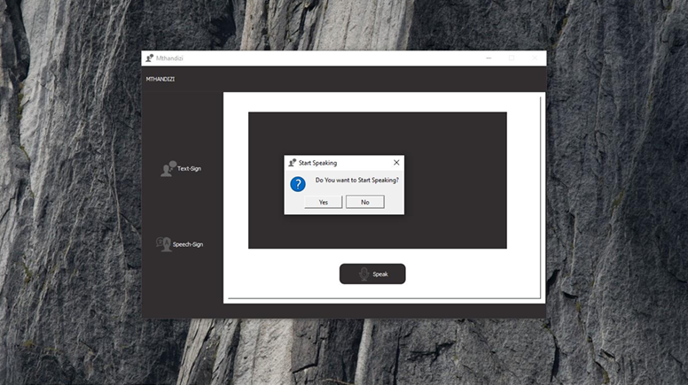
  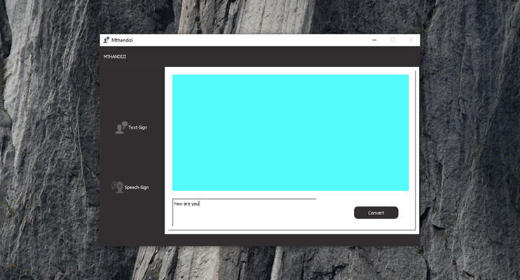
  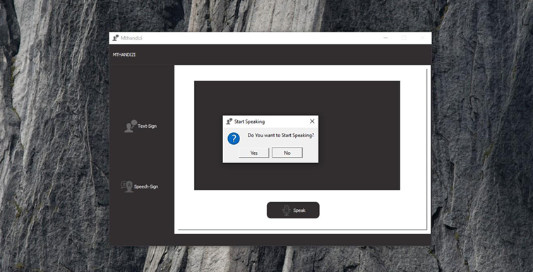
  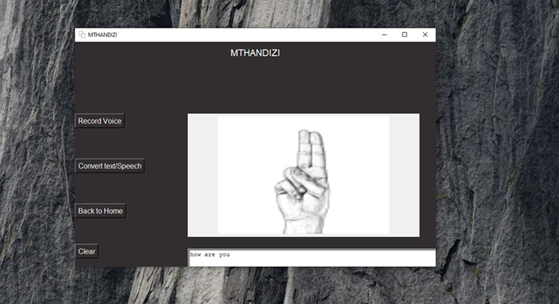
  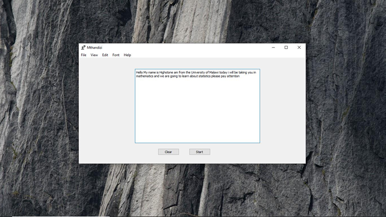
  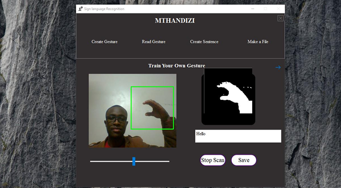
  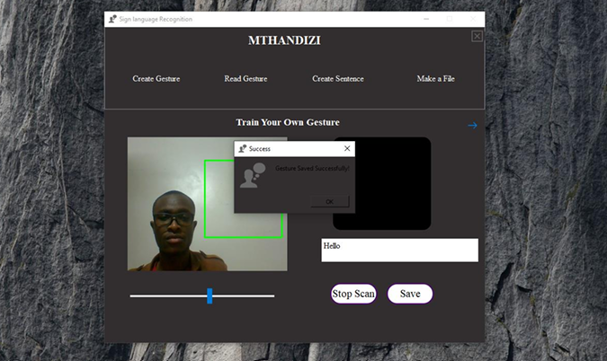
  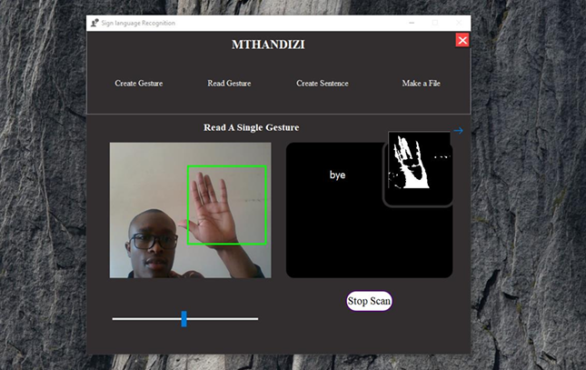

---

## 🛠️ Installation

1. Extract the installation folder with WinRAR  
2. Look for an executable `.exe` file of the software  
3. Click to run the application  
4. If an error appears:  
   - “Ordinal could not be located…”  
   - Fix it by installing **Microsoft Visual C++ Redistributable 2008 SP1**  

---

## 🚀 Future Scope

1. Achieve higher accuracy in complex backgrounds  
2. Full motion interpretation for continuous signing  
3. Connect every student with the system
4. Performance improvement
5. Broader coverage
6. System redesign

---

## 🧾 Conclusion

Mthandizi aims to provides a direct mode of communication between natural language speakers and the deaf.  Serving as a valuable tool for the **deaf community in Malawi** and beyond.

> "Mthandizi isn’t just software — it’s a movement toward accessibility, dignity, and inclusion.

## 🤝 Collaboration

For collaboration, contributions, or knowledge sharing, feel free to reach out:  
📧 **hylukayange@gmail.com**
